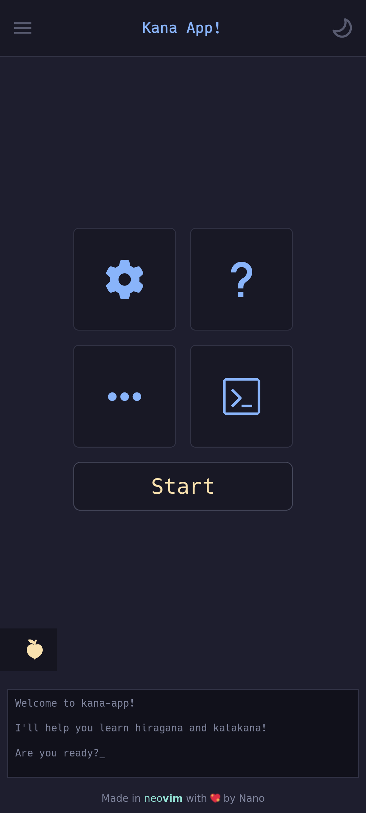
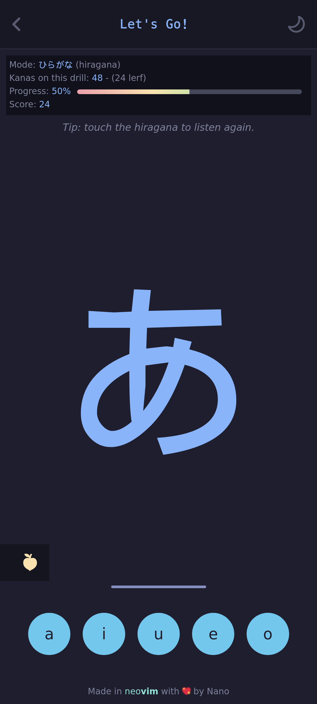
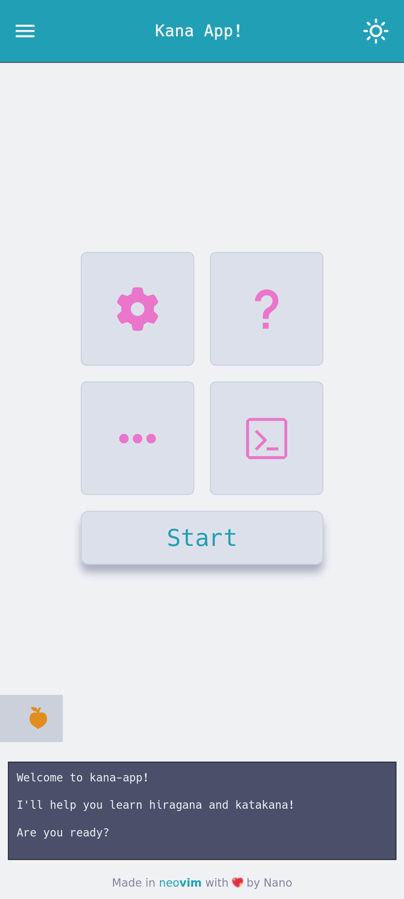
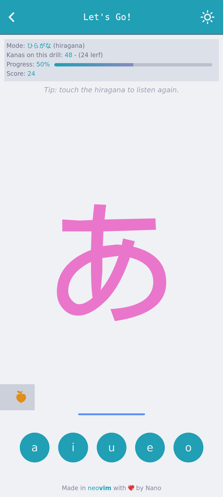

# kana-app

> [!WARNING]
> This project is in a very early stage. A lot of features are still missing.

Learn Japanese.

> [!NOTE]
> _For learners of Japanese as a second language._ We assume you already know how to read in your own
> language (English for now, but internationalisation/localisation is on the way).

    
    
    
    

> [!NOTE]
> **kana-app** aims to be a useful tool for learners of Japanese.

# Wishlist

I've started **kana-app** as a personal project (it still is) because I needed an app to practice
_hiragana_ and _katakana_ in my free time. So, the main purpose of the app is just that: help you
learn _hiragana_ and _katakana_. 

Once that's "done", I may be adding more features (i.e. learning words, grammar, etc).

For now, this are roughly the features I want to get working in the app:

- [ ] Kana drills: Listen to the sounds and guess the right _romaji_ for the given kana.
    - [x] Hiragana.
    - [x] Katakana.
- [ ] Learn _hiragana_:
    - [ ] Learn one kana at a time.
    - [ ] Listen to the sound.
    - [ ] See the corresponding hiragana character (use a textbook font).
    - [ ] Accompany with a word and an image (of that word of course).
    - [ ] Show its _romaji_ representation.
    - [ ] Show its corresponding _katakana_.
- [ ] Learn _katakana_:
    - [ ] Learn one kana at a time.
    - [ ] Listen to the sound.
    - [ ] See the corresponding hiragana character (use a textbook font).
    - [ ] Accompany with a word and an image (of that word of course).
    - [ ] Show its _romaji_ representation.
    - [ ] Show its corresponding _hiragana_.
- [ ] i18n/l10n.
    - [ ] Spanish.
    - [ ] Japanese?

That will cover the basic stuff and also include some words by the way.

This app is intended for learners of Japanese as a second language (as myself).
It assumes that you already know how to read \[this\]. It may be useful in other contexts too but
for now that far beyond the intended scope.

# Target devices

For now the only targeted devices are smartphones, so it looks awful anywhere else.

Making the app responsive is last on the list, but at least I'll provide a usable version for desktop
computers and tablets (someday).

> [!IMPORTANt]
> **WIP**: This app _including this README_ is a work in progress!
> Expect a lot of breaking changes (and a lot of changes in general).
> I'll try to keep a stable version deployed on Github pages.
> See the list of versions and releases for more info.

# Contributing

WIP

# Technologies

WIP

# Installing

WIP

# License

**GPL-3.0** This app is free and open source software.
